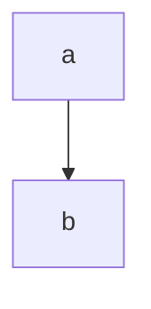

export const meta = {
    author: '作者'
}

# 你

react组件：<button onClick={() => {alert('哈哈')}}>按钮</button>
自定义组件：<Counter/>
 {alert('img load xss')}} onError={() => {alert('img error xss')}}/>
<iframe src="https://www.github.com" onLoad={() => alert('iframe load xss')} onError={() => alert('iframe error xss')}/>
<iframe src="javascript:alert('iframe src xss')"/>

## 目录

## 好

自动链接：https://www.github.com
[手动链接](https://www.github.com)

~下标~[^为什么]^上标^~~删除~~

[^为什么]: 给remark-gfm关掉了singleTilde

```javascript
console.log('这是一段js代码')
```

$\|$^[这玩意儿很容易渲染错]

$$
\KaTeX
$$



## 世

<blockquote>

    html blockquote

    > <ruby>html ruby<rp>（</rp><rt>嵌套引用</rt><rp>）</rp></ruby>

</blockquote>

### 界

1. a
2. b

- a
- b

* [ ] 待办
* [x] 已办

| a | b |
|---|---|

[//]: # (取消注释会导致：<编译错误)
